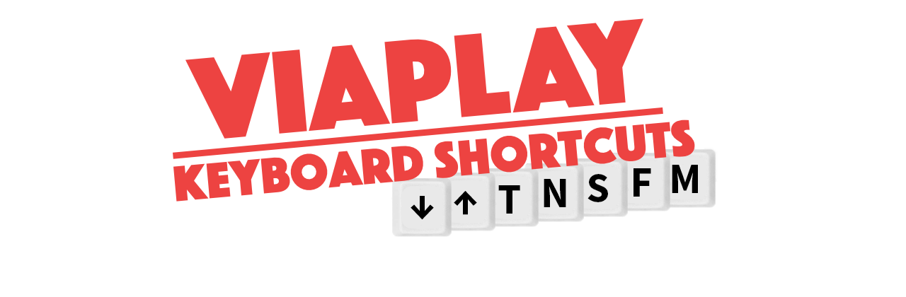

[](https://chrome.google.com/webstore/detail/viaplay-keyboard-shortcut/dgnkgalpolbfilhhdejcbbapehkbjdkl)
[](https://addons.mozilla.org/en-US/firefox/addon/viaplay-keyboard-shortcuts/)
# Features

- `m`     - Mute/Unmute  
- `f`     - Enable/Disable Fullscreen (double-click also works since patch-4)  
- `s`     - Skip Intro/Recap  
- `n`     - Quickstart Next Episode (Skip End Credits)  
- `t`     - Cycle subtitles, hold to toggle on/off
- `up`    - Increase volume  
- `down`  - Decrease volume  
- Hide mouse when idle  

# Viaplay Keyboard Shortcuts (Chrome Extension)



Viaplay is a streaming service with very limited hotkey functionality. This extension aims to solve that problem.

(PS. There is also one [one for Telia TV](https://github.com/Hamatti/teliatv-keyboard-shortcuts))

## How to use?
For Chromium based browsers and Firefox click the buttons at the top of this document.
### Manual installation for Chromium Browsers
Download and unzip the latest release (to the right) and place it into a folder. Then open your browser, go to [chrome://extensions](chrome://extensions), enable Developer mode from the toggle and select "Load unpacked" and navigate to the folder you unzipped it into. Then select the dist folder.

Now whenever you navigate to [viaplay.fi](https://viaplay.fi) (or other Viaplay domains) and start playing a video, the new keyboard shortcuts will be available.

## Note

Please note that this extension is not affiliated, endorsed or supported by Viaplay or Viasat. It is a hobby project built by users.

## Contributing

Setup  
```npm install```  
Build  
```npm run build```  
The build folder (dist/) is configured in webpack/webpack.config.js. content.ts and script.ts are added to dist/ along with anything inside public/. You can add more files to src/scripts, just remember to add the relevant changes to webpack.config.js.  

## LICENSE

Copyright 2020 Juha-Matti Santala

Permission is hereby granted, free of charge, to any person obtaining a copy of this software and associated documentation files (the "Software"), to deal in the Software without restriction, including without limitation the rights to use, copy, modify, merge, publish, distribute, sublicense, and/or sell copies of the Software, and to permit persons to whom the Software is furnished to do so, subject to the following conditions:

The above copyright notice and this permission notice shall be included in all copies or substantial portions of the Software.

THE SOFTWARE IS PROVIDED "AS IS", WITHOUT WARRANTY OF ANY KIND, EXPRESS OR IMPLIED, INCLUDING BUT NOT LIMITED TO THE WARRANTIES OF MERCHANTABILITY, FITNESS FOR A PARTICULAR PURPOSE AND NONINFRINGEMENT. IN NO EVENT SHALL THE AUTHORS OR COPYRIGHT HOLDERS BE LIABLE FOR ANY CLAIM, DAMAGES OR OTHER LIABILITY, WHETHER IN AN ACTION OF CONTRACT, TORT OR OTHERWISE, ARISING FROM, OUT OF OR IN CONNECTION WITH THE SOFTWARE OR THE USE OR OTHER DEALINGS IN THE SOFTWARE.
